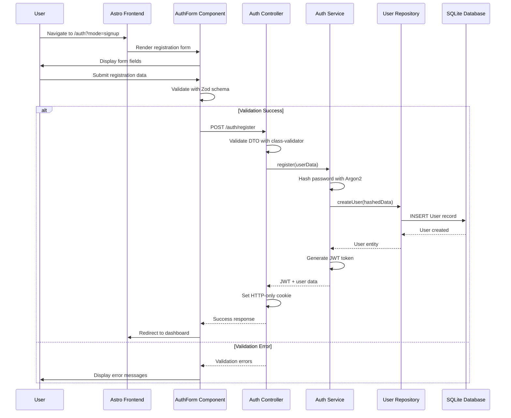
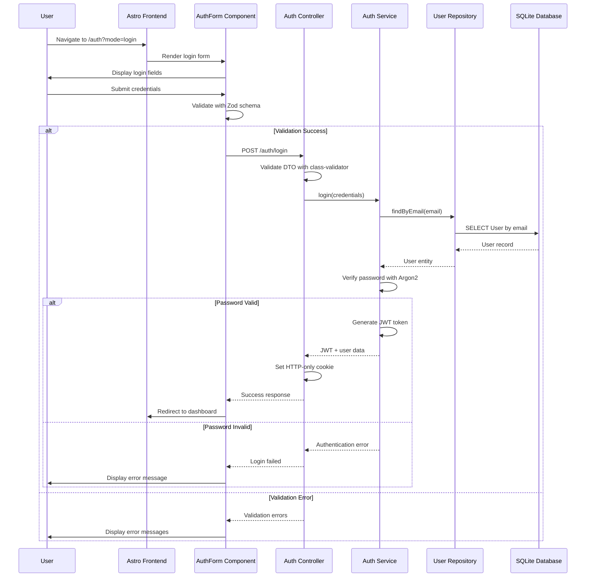
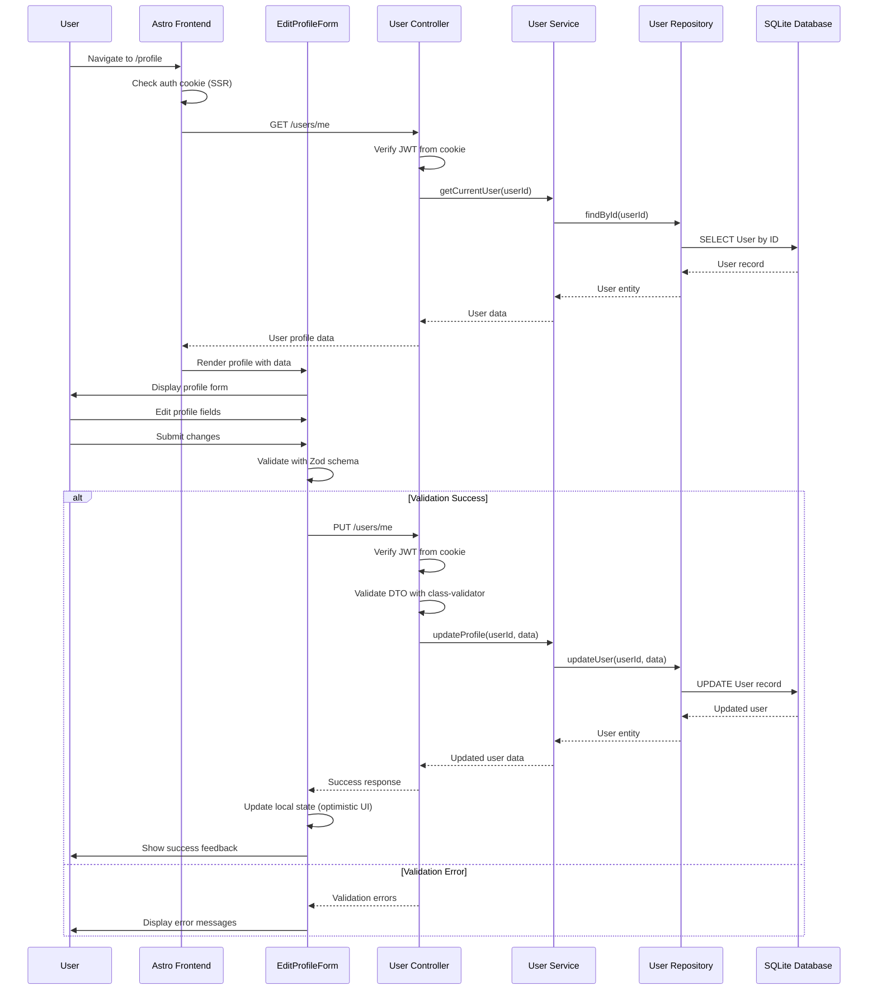

# NestJS + Astro Fullstack Application Architecture Document

| Change           | Date       | Version | Description                                             | Author                    |
| ---------------- | ---------- | ------- | ------------------------------------------------------- | ------------------------- |
| Initial Creation | 2025-07-28 | 1.0     | Architecture blueprint for BMAD Epic 0-4 transformation | Winston (Architect Agent) |

## Introduction

This document outlines the overall project architecture for **NestJS + Astro Fullstack
Application**, including backend systems, shared services, and non-UI specific concerns. Its primary
goal is to serve as the guiding architectural blueprint for AI-driven development, ensuring
consistency and adherence to chosen patterns and technologies during the Epic 0-4 BMAD methodology
transformation.

**Relationship to Frontend Architecture:** If the project includes a significant user interface, a
separate Frontend Architecture Document will detail the frontend-specific design and MUST be used in
conjunction with this document. Core technology stack choices documented herein (see "Tech Stack")
are definitive for the entire project, including any frontend components.

### Starter Template Analysis

**Decision: Custom BMAD-Driven Architecture Evolution**

This project represents a **strategic architectural evolution** guided by BMAD methodology. The
architecture will transform from the current functional state to a highly scalable, maintainable
system through 5 sequential epics:

- **Epic 0**: BMAD methodology establishment (PREREQUISITE)
- **Epic 1**: Monorepo restructuring (apps/ and packages/ directories)
- **Epic 2**: Backend Clean Architecture + DDD refactoring
- **Epic 3**: Frontend component-type-based restructuring
- **Epic 4**: Shared configuration packages

The current functional codebase provides a solid foundation for incremental refactoring without
breaking existing functionality. This is NOT based on a starter template but rather a mature,
custom-built application with established architectural patterns that will evolve through systematic
BMAD-driven transformation.

## High Level Architecture

### Technical Summary

The system follows a **Turborepo monorepo architecture** with clear separation between deployable
applications (`apps/`) and reusable packages (`packages/`). The backend implements **Clean
Architecture principles within Domain-Driven Design (DDD) Bounded Contexts**, ensuring business
logic independence from infrastructure concerns. The frontend adopts a **component-type-based
organization** with Astro's hybrid SSR/SPA approach for optimal performance. **Shared configuration
packages** enforce consistency across all applications, while **Docker containerization** enables
scalable deployment. This architecture directly supports the PRD's goals of long-term
maintainability, developer experience optimization, and systematic BMAD-driven development
processes.

### High Level Overview

**Architectural Style**: **Modular Monorepo with Clean Architecture + DDD**

- **Repository Structure**: Monorepo (Turborepo + Yarn Workspaces) transitioning to `apps/` and
  `packages/` separation
- **Service Architecture**: Logical service separation within monorepo (Auth Context, User Context,
  Shared Context)
- **Primary User Flow**:
  1. User accesses Astro frontend (SSR for initial load, hydrated React components for
     interactivity)
  2. Authentication via JWT HTTP-only cookies
  3. API calls routed through Astro proxy to NestJS backend
  4. Backend processes requests through Clean Architecture layers (Controller → Use Case → Domain →
     Repository)
  5. Data persistence via Prisma ORM to SQLite database

**Key Architectural Decisions**:

- **Clean Architecture + DDD**: Separates business logic from infrastructure, organized by bounded
  contexts
- **Monorepo Structure**: Apps and packages separation for clear distinction between deployable and
  reusable code
- **Component-Type Organization**: Frontend organized by component function rather than feature for
  better reusability
- **Shared Configuration**: Centralized TypeScript and ESLint configs via workspace packages
- **Cookie-Based Authentication**: HTTP-only cookies for enhanced security over localStorage JWT
  storage

### Architectural and Design Patterns

**Domain-Driven Design (DDD) with Bounded Contexts**

- **Pattern**: Organize backend code by business domains (Auth, User, Shared) rather than technical
  layers
- **Rationale**: Aligns code structure with business concepts, reduces coupling between domains,
  enables independent evolution of business logic

**Clean Architecture Layers**

- **Pattern**: Domain → Application → Infrastructure dependency flow within each bounded context
- **Rationale**: Ensures business logic independence from frameworks and external concerns, enables
  easier testing and technology changes

**Component-Type Organization (Frontend)**

- **Pattern**: Organize React components by functional type (forms/, icons/, layouts/, ui/) rather
  than by feature
- **Rationale**: Improves component reusability across features, reduces duplication, makes
  components easier to locate and maintain

**Repository Pattern with Interface Segregation**

- **Pattern**: Abstract data access behind interfaces in domain layer, implement in infrastructure
  layer
- **Rationale**: Enables easy testing with mocks, supports future database technology changes,
  maintains Clean Architecture principles

**Shared Configuration via Workspace Packages**

- **Pattern**: Centralize TypeScript and ESLint configurations in dedicated packages
  (`@repo/typescript-config`, `@repo/eslint-config`)
- **Rationale**: Enforces consistency across all applications, leverages monorepo structure, reduces
  configuration drift

**Hybrid SSR/SPA with Astro**

- **Pattern**: Server-side render initial page load, hydrate with React for client-side
  interactivity
- **Rationale**: Optimal performance (fast initial load) while maintaining rich user experience, SEO
  benefits

**JWT with HTTP-Only Cookies**

- **Pattern**: Store authentication tokens in secure HTTP-only cookies rather than localStorage
- **Rationale**: Enhanced security against XSS attacks, automatic cookie handling, better mobile app
  integration potential

## Tech Stack

### Cloud Infrastructure

- **Provider:** Self-hosted (Debian 12 server)
- **Key Services:** Docker containers, local networking, Portainer management, NginxProxyManager
- **Deployment Regions:** Single server deployment

### Technology Stack Table

| Category                   | Technology              | Version            | Purpose                      | Rationale                                                                             |
| -------------------------- | ----------------------- | ------------------ | ---------------------------- | ------------------------------------------------------------------------------------- |
| **Runtime**                | Node.js                 | 22.17.0            | JavaScript runtime           | Latest LTS version, optimal performance, long-term support                            |
| **Language**               | TypeScript              | 5.8.3+             | Primary development language | Strong typing, excellent tooling, team expertise, already using latest stable         |
| **Package Manager**        | Yarn                    | 4.9.1              | Dependency management        | Workspaces support, performance, already configured                                   |
| **Monorepo**               | Turborepo               | 2.5.3              | Task orchestration           | Build caching, parallel execution, monorepo optimization                              |
| **Backend Framework**      | NestJS                  | 11.1.1             | API framework                | Enterprise-ready, dependency injection, TypeScript-first, Clean Architecture friendly |
| **Frontend Framework**     | Astro                   | 5.8.0              | Meta-framework               | SSR/SSG capabilities, component flexibility, performance-focused                      |
| **UI Library**             | React                   | 19.1.0             | Component library            | Rich ecosystem, team familiarity, Astro integration                                   |
| **Database**               | SQLite                  | Latest             | Development database         | Lightweight, zero-config, file-based                                                  |
| **Future Database**        | PostgreSQL              | 15+                | Production database          | ACID compliance, scalability, enterprise features                                     |
| **ORM**                    | Prisma                  | 6.8.2              | Database toolkit             | Type-safe queries, migrations, excellent DX                                           |
| **Authentication**         | JWT + Cookies           | @nestjs/jwt 11.0.0 | Auth mechanism               | Secure, stateless, HTTP-only cookie storage                                           |
| **Password Hashing**       | Argon2                  | 0.43.0             | Password security            | Modern, secure, winner of password hashing competition                                |
| **Validation**             | Zod                     | 3.25.23            | Schema validation            | TypeScript-first, runtime safety, frontend validation                                 |
| **Backend Validation**     | class-validator         | Latest             | DTO validation               | NestJS integration, decorator-based, server-side validation                           |
| **Form Management**        | React Hook Form         | 7.56.4             | Form state                   | Performance, minimal re-renders, excellent DX                                         |
| **Styling**                | TailwindCSS             | 4.1.7              | CSS framework                | Utility-first, performance, design system consistency                                 |
| **Testing (Backend)**      | Jest                    | 29.7.0             | Unit/integration testing     | Mature ecosystem, mocking capabilities, NestJS integration                            |
| **Testing (Frontend)**     | Vitest                  | 3.1.4              | Unit testing                 | Fast, Vite integration, Jest-compatible API                                           |
| **Testing Utils**          | React Testing Library   | 16.3.0             | Component testing            | Best practices, accessibility-focused, user-centric                                   |
| **Containerization**       | Docker                  | Latest             | Deployment                   | Consistent environments, isolation, Debian 12 compatibility                           |
| **Linting**                | ESLint                  | 9.27.0             | Code quality                 | Code consistency, error prevention                                                    |
| **Formatting**             | Prettier                | 3.5.3              | Code formatting              | Consistent code style, automated formatting                                           |
| **Type Checking**          | TypeScript Compiler     | 5.8.3+             | Static analysis              | Compile-time error detection, IDE support                                             |
| **Shared Config (TS)**     | @repo/typescript-config | workspace:\*       | Centralized TS config        | Epic 4 requirement, consistency across apps                                           |
| **Shared Config (ESLint)** | @repo/eslint-config     | workspace:\*       | Centralized linting          | Epic 4 requirement, unified code standards                                            |

**Database Evolution Strategy:**

- **Phase 1**: Continue with SQLite for development and initial deployment
- **Phase 2**: PostgreSQL migration when scaling requirements justify the complexity
- **Prisma Schema**: Design to be database-agnostic from the start

## Data Models

### Current Schema (Maintain Existing)

The existing Prisma schema is **perfect** for Clean Architecture + DDD learning and should be
maintained:

```sql
-- SQLite Schema (Current Implementation)
-- File: backend/prisma/schema.prisma

model User {
  id String @id @default(uuid())

  -- Authentication fields (Auth Context)
  email     String  @unique
  username  String  @unique
  hash      String
  confirmed Boolean @default(true)
  blocked   Boolean @default(false)

  -- Profile fields (User Context)
  firstName String?
  lastName  String?

  -- Audit fields (Shared)
  createdAt DateTime @default(now())
  updatedAt DateTime @updatedAt
}
```

### Bounded Context Field Mapping

**Auth Context Usage:**

- Fields: `id`, `email`, `username`, `hash`, `confirmed`, `blocked`, `createdAt`
- Operations: Registration, Login, Account status validation
- Domain Model: `AuthUser` entity focusing on authentication behavior

**User Profile Context Usage:**

- Fields: `id`, `email`, `username`, `firstName`, `lastName`, `createdAt`, `updatedAt`
- Operations: Profile viewing, Profile editing, User management
- Domain Model: `UserProfile` entity focusing on profile management behavior

**Shared Fields:**

- Fields: `id` (entity identity), `email`/`username` (shared identifiers)
- Usage: Cross-context user identification

### Epic 2 Implementation Strategy

Instead of changing the schema, Epic 2 will:

1. **Keep exact Prisma schema**
2. **Create domain entities** that model business behavior around the same data
3. **Implement Clean Architecture layers** around existing data structure
4. **Separate contexts in code organization**, not database structure

Both Auth and User repositories will use the same Prisma User model underneath, but expose different
domain interfaces appropriate to their bounded contexts.

## Components

### Auth Context Component

**Responsibility:** Handles user authentication, authorization, and account security operations
while maintaining JWT cookie-based auth flow.

**Key Interfaces:**

- `POST /auth/login` - User authentication endpoint
- `POST /auth/register` - User registration endpoint
- `POST /auth/logout` - Session termination endpoint
- `AuthApplicationService` - Application service for auth operations
- `AuthUserRepository` - Data access focused on auth concerns

**Dependencies:**

- Shared Prisma service for database access
- JWT service for token generation/validation
- Argon2 service for password hashing
- Cookie handling middleware

**Technology Stack:**

- NestJS modules for DI and organization
- Prisma Client for User table access (focusing on auth fields)
- JWT library for token operations
- Argon2 for password security

### User Context Component

**Responsibility:** Manages user profile information, account details, and user-facing operations
separate from authentication concerns.

**Key Interfaces:**

- `GET /users/me` - Retrieve current user profile
- `PUT /users/me` - Update user profile information
- `UserApplicationService` - Application service for profile operations
- `UserProfileRepository` - Data access focused on profile management

**Dependencies:**

- Shared Prisma service for database access
- Validation services for profile data
- Auth context for user identity verification

**Technology Stack:**

- NestJS modules for service organization
- Prisma Client for User table access (focusing on profile fields)
- class-validator for input validation
- Zod schemas for frontend validation alignment

### Shared Infrastructure Component

**Responsibility:** Provides common services, configuration, database access, and cross-cutting
concerns used by all bounded contexts.

**Key Interfaces:**

- `PrismaService` - Database connection and client management
- `ConfigService` - Environment variable and configuration management
- `ValidationPipe` - Request validation middleware
- `SerializationInterceptor` - Response formatting

**Dependencies:**

- Prisma Client for database operations
- NestJS Config module for environment handling
- class-transformer for response serialization

**Technology Stack:**

- Prisma ORM with SQLite (current) to PostgreSQL (future) migration path
- NestJS configuration module for env var management
- Shared validation and serialization logic

### Frontend Integration Component

**Responsibility:** Handles API communication, authentication state management, and form validation
on the client side using component-type organization.

**Key Interfaces:**

- `AuthService` (frontend) - API calls for authentication
- `UserService` (frontend) - API calls for profile management
- Form components in `components/forms/` directory
- API utilities in `lib/utils/` directory

**Dependencies:**

- Backend API endpoints (unchanged contracts)
- Zod schemas for frontend validation (separate from backend class-validator)
- React Hook Form for form state management

**Technology Stack:**

- Astro for server-side rendering and API proxying
- React components for interactive UI elements
- Zod for client-side validation
- React Hook Form for form management

## External APIs

This project does **not require external API integrations** for the current scope and Epic
implementations. The system is designed as a complete, self-contained application with:

- Internal authentication system
- Local database storage
- Self-hosted deployment on Debian server
- No third-party service dependencies

The planned Clean Architecture + DDD structure will make adding external APIs straightforward in the
future through the Infrastructure Layer when needed.

## Core Workflows

### User Registration Workflow



### User Login Workflow



### User Profile Management Workflow



**API Compatibility Guarantee:** All HTTP endpoints remain identical during Epic 2 transformation,
ensuring frontend integration is unaffected by internal Clean Architecture + DDD refactoring.

## REST API Spec

```yaml
openapi: 3.0.0
info:
  title: Fullstack NestJS + Astro Application API
  version: 1.0.0
  description: |
    REST API for user authentication and profile management.
    This API contract must remain stable during Epic 2 Clean Architecture + DDD refactoring.
servers:
  - url: http://localhost:3000
    description: Development server
  - url: http://localhost:4321/api
    description: Frontend proxy (Astro dev server)

security:
  - cookieAuth: []

paths:
  /auth/register:
    post:
      tags:
        - Authentication
      summary: Register a new user
      requestBody:
        required: true
        content:
          application/json:
            schema:
              type: object
              required:
                - email
                - username
                - password
              properties:
                email:
                  type: string
                  format: email
                username:
                  type: string
                  minLength: 3
                password:
                  type: string
                  minLength: 8
                firstName:
                  type: string
                lastName:
                  type: string
      responses:
        '201':
          description: User registered successfully
          headers:
            Set-Cookie:
              schema:
                type: string
          content:
            application/json:
              schema:
                $ref: '#/components/schemas/UserResponse'

  /auth/login:
    post:
      tags:
        - Authentication
      summary: Login user
      requestBody:
        required: true
        content:
          application/json:
            schema:
              type: object
              required:
                - emailOrUsername
                - password
              properties:
                emailOrUsername:
                  type: string
                password:
                  type: string
      responses:
        '200':
          description: Login successful
          headers:
            Set-Cookie:
              schema:
                type: string
          content:
            application/json:
              schema:
                $ref: '#/components/schemas/UserResponse'

  /auth/logout:
    post:
      tags:
        - Authentication
      summary: Logout user
      responses:
        '200':
          description: Logout successful

  /users/me:
    get:
      tags:
        - User Profile
      summary: Get current user profile
      security:
        - cookieAuth: []
      responses:
        '200':
          description: User profile retrieved successfully
          content:
            application/json:
              schema:
                $ref: '#/components/schemas/UserResponse'

    put:
      tags:
        - User Profile
      summary: Update current user profile
      security:
        - cookieAuth: []
      requestBody:
        required: true
        content:
          application/json:
            schema:
              type: object
              properties:
                email:
                  type: string
                  format: email
                username:
                  type: string
                firstName:
                  type: string
                lastName:
                  type: string
      responses:
        '200':
          description: Profile updated successfully
          content:
            application/json:
              schema:
                $ref: '#/components/schemas/UserResponse'

components:
  securitySchemes:
    cookieAuth:
      type: apiKey
      in: cookie
      name: auth_token

  schemas:
    UserResponse:
      type: object
      properties:
        id:
          type: string
          format: uuid
        email:
          type: string
          format: email
        username:
          type: string
        firstName:
          type: string
          nullable: true
        lastName:
          type: string
          nullable: true
        confirmed:
          type: boolean
        blocked:
          type: boolean
        createdAt:
          type: string
          format: date-time
        updatedAt:
          type: string
          format: date-time
```

**Epic 2 Implementation Guarantee:** Exact same HTTP endpoints, request/response schemas, and
authentication mechanisms will be maintained throughout Clean Architecture + DDD refactoring.

## Database Schema

### Current Schema (Keep As-Is)

```sql
-- SQLite Schema (Current Implementation)
-- File: backend/prisma/schema.prisma

generator client {
  provider = "prisma-client-js"
}

datasource db {
  provider = "sqlite"
  url      = env("DATABASE_URL")
}

model User {
  id String @id @default(uuid())

  -- Authentication fields (Auth Context)
  email     String  @unique
  username  String  @unique
  hash      String
  confirmed Boolean @default(true)
  blocked   Boolean @default(false)

  -- Profile fields (User Context)
  firstName String?
  lastName  String?

  -- Audit fields (Shared)
  createdAt DateTime @default(now())
  updatedAt DateTime @updatedAt
}
```

### Epic 2 Implementation Strategy

**Domain Models (Different Views of Same Data):**

- **AuthUser Entity**: Focuses on authentication behavior, uses auth-related fields
- **UserProfile Entity**: Focuses on profile management, uses profile-related fields
- **Repository Pattern**: Both contexts access same User table through different repository
  interfaces

**Migration Path: SQLite → PostgreSQL**

- **Phase 1 (Current)**: SQLite development with simple schema
- **Phase 2 (Future)**: PostgreSQL with enhanced constraints and indexing when scaling needs justify
  complexity

## Source Tree

### Target Project Structure (Post-Epic Implementation)

```plaintext
project-root/
├── apps/                                    # Epic 1: Deployable applications
│   ├── backend/                            # NestJS API application
│   │   ├── src/
│   │   │   ├── auth/                       # Auth Module (Clean Architecture)
│   │   │   │   ├── Auth.module.ts
│   │   │   │   ├── domain/
│   │   │   │   │   ├── entities/
│   │   │   │   │   │   └── AuthUser.entity.ts
│   │   │   │   │   ├── repositories/
│   │   │   │   │   │   └── AuthUser.repository.ts
│   │   │   │   │   └── value-objects/
│   │   │   │   │       ├── Email.vo.ts
│   │   │   │   │       └── Password.vo.ts
│   │   │   │   ├── application/
│   │   │   │   │   ├── use-cases/
│   │   │   │   │   │   ├── Login.uc.ts
│   │   │   │   │   │   ├── Register.uc.ts
│   │   │   │   │   │   └── Logout.uc.ts
│   │   │   │   │   ├── dtos/
│   │   │   │   │   │   ├── Login.dto.ts
│   │   │   │   │   │   └── Register.dto.ts
│   │   │   │   │   └── services/
│   │   │   │   │       └── Auth.service.ts
│   │   │   │   └── infrastructure/
│   │   │   │       ├── controllers/
│   │   │   │       │   └── Auth.controller.ts
│   │   │   │       ├── repositories/
│   │   │   │       │   └── PrismaAuthUser.repository.ts
│   │   │   │       └── services/
│   │   │   │           ├── Jwt.service.ts
│   │   │   │           └── Password.service.ts
│   │   │   ├── users/                      # User Module (Clean Architecture)
│   │   │   │   ├── Users.module.ts
│   │   │   │   ├── domain/
│   │   │   │   │   ├── entities/
│   │   │   │   │   │   └── User.entity.ts
│   │   │   │   │   └── repositories/
│   │   │   │   │       └── User.repository.ts
│   │   │   │   ├── application/
│   │   │   │   │   ├── use-cases/
│   │   │   │   │   │   ├── GetUserProfile.uc.ts
│   │   │   │   │   │   └── UpdateUserProfile.uc.ts
│   │   │   │   │   ├── dtos/
│   │   │   │   │   │   ├── UpdateUser.dto.ts
│   │   │   │   │   │   └── UserResponse.dto.ts
│   │   │   │   │   └── services/
│   │   │   │   │       └── User.service.ts
│   │   │   │   └── infrastructure/
│   │   │   │       ├── controllers/
│   │   │   │       │   └── User.controller.ts
│   │   │   │       ├── repositories/
│   │   │   │       │   └── PrismaUser.repository.ts
│   │   │   │       └── mappers/
│   │   │   │           └── User.mapper.ts
│   │   │   ├── shared/                     # Shared Module (Clean Architecture)
│   │   │   │   ├── Shared.module.ts
│   │   │   │   ├── domain/
│   │   │   │   │   ├── value-objects/
│   │   │   │   │   │   ├── UserId.vo.ts
│   │   │   │   │   │   └── Base.entity.ts
│   │   │   │   │   └── exceptions/
│   │   │   │   │       ├── Domain.exception.ts
│   │   │   │   │       └── NotFound.exception.ts
│   │   │   │   └── infrastructure/
│   │   │   │       ├── services/
│   │   │   │       │   ├── Prisma.service.ts
│   │   │   │       │   └── Config.service.ts
│   │   │   │       └── interceptors/
│   │   │   │           └── Serialization.interceptor.ts
│   │   │   ├── AppModule.ts               # Root application module
│   │   │   └── main.ts                     # Application entry point
│   │   ├── prisma/
│   │   │   ├── schema.prisma               # Database schema (unchanged)
│   │   │   └── migrations/                 # Database migrations
│   │   ├── test/                           # E2E tests
│   │   ├── package.json                    # Epic 4: Uses shared configs
│   │   ├── tsconfig.json                   # Extends @repo/typescript-config
│   │   └── eslint.config.cjs               # Extends @repo/eslint-config
│   │
│   └── web/                           # Astro + React application
│       ├── src/
│       │   ├── components/                 # Epic 3: Component-type organization
│       │   │   ├── forms/                  # Form components
│       │   │   │   ├── AuthForm.tsx
│       │   │   │   ├── EditProfileForm.tsx
│       │   │   │   └── index.ts
│       │   │   ├── icons/                  # Icon components
│       │   │   │   ├── BackIcon.tsx
│       │   │   │   ├── CoffeeIcon.tsx
│       │   │   │   ├── CopyLeftIcon.tsx
│       │   │   │   ├── HeartIcon.tsx
│       │   │   │   └── index.ts
│       │   │   ├── layouts/                # Layout components
│       │   │   │   ├── Main.astro
│       │   │   │   └── index.ts
│       │   │   └── ui/                     # Base UI components
│       │   │       ├── Button.tsx
│       │   │       ├── Input.tsx
│       │   │       └── index.ts
│       │   ├── lib/                        # Epic 3: Shared utilities
│       │   │   ├── schemas/                # Zod validation schemas
│       │   │   │   ├── AuthSchema.ts
│       │   │   │   ├── UserSchema.ts
│       │   │   │   └── index.ts
│       │   │   ├── types/                  # TypeScript types
│       │   │   │   ├── ApiTypes.ts
│       │   │   │   ├── AuthTypes.ts
│       │   │   │   ├── UserTypes.ts
│       │   │   │   └── index.ts
│       │   │   └── utils/                  # Utility functions
│       │   │       ├── Navigation.ts
│       │   │       ├── Routes.ts
│       │   │       └── index.ts
│       │   ├── hooks/                      # React hooks
│       │   │   └── useAuthForm.tsx
│       │   ├── pages/                      # Astro pages
│       │   │   ├── auth.astro
│       │   │   ├── index.astro
│       │   │   ├── logout.astro
│       │   │   └── profile.astro
│       │   ├── services/                   # API services
│       │   │   ├── ApiService.ts
│       │   │   ├── AuthService.ts
│       │   │   └── UserService.ts
│       │   ├── styles/                     # Global styles
│       │   │   └── globals.css
│       │   └── middleware.ts               # Astro middleware
│       ├── public/                         # Static assets
│       │   └── favicon.svg
│       ├── tests/                          # Frontend tests
│       ├── package.json                    # Epic 4: Uses shared configs
│       ├── tsconfig.json                   # Extends @repo/typescript-config
│       └── eslint.config.cjs               # Extends @repo/eslint-config
│
├── packages/                               # Epic 4: Shared packages
│   ├── typescript-config/                 # Shared TypeScript configurations
│   │   ├── package.json
│   │   ├── base.json                       # Base TypeScript config
│   │   ├── node.json                       # Node.js specific config
│   │   ├── react.json                      # React/browser specific config
│   │   └── README.md
│   │
│   └── eslint-config/                      # Shared ESLint configurations
│       ├── package.json
│       ├── base.js                         # Base ESLint config
│       ├── node.js                         # Node.js specific config
│       ├── react.js                        # React specific config
│       └── README.md
│
├── docker/                                 # Epic 1: Updated paths
│   ├── Dockerfile.backend                  # References apps/api
│   ├── Dockerfile.frontend                 # References apps/web
│   ├── compose.yaml                        # Production deployment (Portainer)
│   └── start.sh                            # Build scripts
│
├── docs/                                   # Documentation
│   ├── prd.md                             # Project requirements
│   └── architecture.md                    # This document
│
├── package.json                           # Epic 1: Updated workspaces
├── turbo.json                             # Epic 1: Updated pipeline paths
├── yarn.lock                              # Lockfile
└── README.md                              # Root documentation
```

**Key Organizational Principles:**

- **~/Path Aliases**: All imports use `~/` path alias pattern (existing excellent approach)
- **CamelCase Naming**: All file names use CamelCase/PascalCase (existing pattern)
- **Clean Architecture Layers**: Domain → Application → Infrastructure within each bounded context
- **Component-Type Organization**: Frontend organized by component function rather than feature

## Infrastructure and Deployment

### Infrastructure as Code

- **Tool:** Docker Compose (via Portainer UI)
- **Location:** `docker/compose.yaml` (for copy/paste to Portainer)
- **Approach:** Container orchestration through Portainer web interface

### Deployment Strategy

- **Strategy:** Portainer-managed container deployment
- **Target Platform:** Self-hosted Debian 12 server with existing infrastructure
- **Pipeline Configuration:** Manual deployment via Portainer UI

**Actual Deployment Flow:**

1. **Build Images**: Local Docker builds
2. **Portainer**: Copy/paste `docker/compose.yaml` into Portainer interface
3. **Deploy**: Portainer manages container lifecycle
4. **Proxy**: NginxProxyManager handles SSL termination and routing

### Current Working Configuration (Maintain As-Is)

```yaml
# docker/compose.yaml - Production deployment configuration
version: '3.8'

services:
  fullstack-nest-backend:
    image: lgdweb/fullstack-nest-backend:prod
    container_name: fullstack-nest-backend
    environment:
      DATABASE_URL: ${DATABASE_URL}
      JWT_SECRET: ${JWT_SECRET}
      JWT_EXPIRES_IN: ${JWT_EXPIRES_IN}
      SESSION_TTL: ${SESSION_TTL}
      RUN_MIGRATIONS: 'true'
    volumes:
      - data:/data
      - /etc/localtime:/etc/localtime:ro
      - /etc/timezone:/etc/timezone:ro
    networks:
      - reverse-proxy-nw
      - default-nw
    restart: unless-stopped

  fullstack-astro-frontend:
    image: lgdweb/fullstack-astro-frontend:prod
    container_name: fullstack-astro-frontend
    environment:
      API_URL: ${API_URL}
      PUBLIC_API_URL: ${PUBLIC_API_URL}
    ports:
      - 4321:4321
    networks:
      - reverse-proxy-nw
      - default-nw
    restart: unless-stopped
    depends_on:
      - fullstack-nest-backend

volumes:
  data:

networks:
  default-nw:
    external: true
  reverse-proxy-nw:
    external: true
```

**Epic Impact: MINIMAL Changes Only**

- **Epic 1**: Update Dockerfiles to use `apps/` paths, compose.yaml unchanged
- **Epic 2-4**: No infrastructure changes, same container behavior

**Existing Server Infrastructure:**

- ✅ **Debian 12 Server**: Already configured
- ✅ **Portainer**: Already installed for container management
- ✅ **NginxProxyManager**: Already handling SSL/reverse proxy
- ✅ **Docker**: Already installed and configured

## Error Handling Strategy

### General Approach

- **Error Model:** Exception-based error handling with typed error responses
- **Exception Hierarchy:** NestJS built-in exceptions + custom business exceptions
- **Error Propagation:** Domain → Application → Infrastructure with proper error transformation

### Logging Standards

- **Library:** NestJS built-in Logger
- **Format:** JSON structured logging for production
- **Levels:** ERROR, WARN, LOG, DEBUG, VERBOSE
- **Required Context:** Correlation ID, service context, user context (when authenticated)

### Error Handling Patterns

**Business Logic Errors:**

- **Custom Exceptions:** Domain-specific exceptions for business rule violations
- **User-Facing Errors:** Consistent error response format for frontend
- **Error Codes:** Simple string-based error codes for frontend handling

**Data Consistency:**

- **Transaction Strategy:** Single SQLite transactions (current simple approach)
- **Compensation Logic:** Not needed for single-database operations
- **Idempotency:** Handled at application layer for critical operations

**Epic 2 Implementation Pattern:**

```typescript
// Domain Layer (Auth Context)
export class AuthenticationFailedException extends Error {
  constructor(message: string = 'Authentication failed') {
    super(message)
    this.name = 'AuthenticationFailedException'
  }
}

// Application Layer
export class AuthApplicationService {
  async login(credentials: LoginCredentials): Promise<AuthResult> {
    try {
      const user = await this.authUserRepository.findByEmail(credentials.email)
      if (!user || !user.verifyPassword(credentials.password)) {
        throw new AuthenticationFailedException('Invalid email or password')
      }
      return this.generateAuthResult(user)
    } catch (error) {
      this.logger.error('Login failed', { email: credentials.email, error: error.message })
      throw error
    }
  }
}

// Infrastructure Layer
@Controller('auth')
export class AuthController {
  @Post('login')
  async login(@Body() loginDto: LoginDto): Promise<UserResponse> {
    try {
      return await this.authApplicationService.login(loginDto)
    } catch (error) {
      if (error instanceof AuthenticationFailedException) {
        throw new UnauthorizedException({
          message: 'Login failed',
          error: 'INVALID_CREDENTIALS',
          statusCode: 401
        })
      }
      throw new InternalServerErrorException('An unexpected error occurred')
    }
  }
}
```

## Coding Standards

### Core Standards

- **Languages & Runtimes:** TypeScript 5.8.3+, Node.js 22.17.0 LTS
- **Style & Linting:** ESLint 9.27.0 with Prettier 3.5.3 (Epic 4: via shared packages)
- **Test Organization:** `*.spec.ts` files co-located with source files, TDD with AAA pattern

### Import Path Standards

**✅ Use ~/Path Alias (Current Excellent Pattern):**

```typescript
// ✅ CORRECT - Current approach maintained
import { ConfigService } from '~/config/config.service'
import { UserResponseDto } from '~/user/dto'
import { useAuthForm } from '~/hooks/useAuthForm'
import { authenticateUser } from '~/services/auth.service'

// Epic 2 Clean Architecture with ~/paths
import { AuthUserEntity } from '~/auth/domain/entities'
import { LoginUseCase } from '~/auth/application/use-cases'

// Epic 3 Frontend reorganization with ~/paths
import { AuthForm } from '~/components/forms/AuthForm'
import { authSchema } from '~/lib/schemas/AuthSchema'
```

### Naming Conventions

| Element                        | Convention                             | Example                                       |
| ------------------------------ | -------------------------------------- | --------------------------------------------- |
| **Files**                      | CamelCase/PascalCase (current pattern) | `AuthUser.entity.ts`, `LoginUseCase.ts`       |
| **Domain Entities**            | PascalCase with context suffix         | `AuthUser`, `UserProfile`                     |
| **Use Cases**                  | PascalCase with UseCase suffix         | `LoginUseCase`, `UpdateProfileUseCase`        |
| **Repository Interfaces**      | PascalCase with Repository suffix      | `AuthUserRepository`, `UserProfileRepository` |
| **Repository Implementations** | PascalCase with provider prefix        | `PrismaAuthUserRepository`                    |
| **DTOs**                       | PascalCase with Dto suffix             | `LoginDto`, `UpdateUserDto`                   |

### Critical Rules

**Epic 2 Clean Architecture Rules:**

**Dependency Rule Enforcement:**

```typescript
// ✅ CORRECT - Domain layer using path alias
import { UserIdValueObject } from '~/shared/domain/value-objects'

// ❌ WRONG - Domain importing infrastructure
import { PrismaService } from '~/shared/infrastructure/services'
```

**Repository Pattern Compliance:**

```typescript
// ✅ CORRECT - Repository abstraction
const user = await this.userRepository.findById(id)

// ❌ WRONG - Direct Prisma usage in use case
const user = await this.prisma.user.findUnique({ where: { id } })
```

**Bounded Context Isolation:**

```typescript
// ✅ CORRECT - Each context uses its own path
import { AuthUserEntity } from '~/auth/domain/entities'
import { IAuthUserRepository } from '~/auth/domain/repositories'

// ❌ WRONG - Direct cross-module imports (use shared module instead)
import { UserEntity } from '~/users/domain/entities' // in auth module
```

## Test Strategy and Standards

### Testing Philosophy

- **Approach:** **Test-Driven Development (TDD)** for learning Clean Architecture + DDD
- **Coverage Goals:** 90%+ through TDD red-green-refactor cycle
- **Test Pyramid:** Unit tests (85%), Integration tests (15%)

**Current Testing Stack:**

- ✅ **Backend:** Jest 29.7.0 with `*.spec.ts` files co-located
- ✅ **Frontend:** Vitest 3.1.4 with React Testing Library
- ✅ **Pattern:** AAA (Arrange-Act-Assert) structure
- ✅ **No E2E tests** (not needed for Clean Architecture learning)

### TDD Workflow for Epic 2

**Domain Entity Development:**

```typescript
// 1. RED - Write failing test first
describe('AuthUser', () => {
  it('should verify correct password', () => {
    // Arrange
    const userData = AuthUserFactory.create()

    // Act & Assert - This will fail because AuthUser doesn't exist yet
    expect(userData.verifyPassword('correct')).toBe(true)
  })
})

// 2. GREEN - Write minimal AuthUser to make test pass
export class AuthUser {
  verifyPassword(password: string): boolean {
    return true // Minimal implementation
  }
}

// 3. REFACTOR - Improve implementation while keeping tests green
export class AuthUser {
  constructor(private passwordHash: string) {}

  verifyPassword(password: string): boolean {
    return argon2.verify(this.passwordHash, password)
  }
}
```

### Test Configuration (Maintain Current)

**Backend Jest Setup:**

```json
{
  "moduleNameMapper": {
    "~/(.*)$": "<rootDir>/src/$1"
  },
  "testRegex": ".*\\.spec\\.ts$",
  "testEnvironment": "node"
}
```

**Frontend Vitest Setup:**

```typescript
{
  "test": {
    "globals": true,
    "environment": "jsdom"
  },
  "resolve": {
    "alias": { "~": path.resolve(__dirname, "./src") }
  }
}
```

**TDD Learning Benefits:**

- **Interface Discovery**: Tests help define repository interfaces before implementation
- **Dependency Direction**: Tests force proper dependency injection design
- **Business Logic Focus**: Domain tests validate business rules without infrastructure
- **Refactoring Safety**: Clean Architecture refactoring supported by comprehensive tests

## Security

### Input Validation

- **Validation Library:** class-validator (backend), Zod (frontend) - current approach maintained
- **Validation Location:** API boundary validation before processing + client-side UX validation
- **Required Rules:**
  - All external inputs MUST be validated at API endpoints using DTOs
  - Frontend validation for user experience only - never trust client validation
  - Whitelist approach: define allowed values, reject everything else

### Authentication & Authorization

- **Auth Method:** JWT tokens in HTTP-only cookies (current implementation)
- **Session Management:** JWT with expiration, secure cookie attributes
- **Required Patterns:**
  - HTTP-only cookies prevent XSS access to tokens
  - Secure flag in production (HTTPS only)
  - SameSite=Strict for CSRF protection
  - Token expiration validation on every request

**Current Security Pattern (Maintain):**

```typescript
const token = jwt.sign(payload, JWT_SECRET, { expiresIn: JWT_EXPIRES_IN })

res.cookie(AUTH_COOKIE_NAME, token, {
  httpOnly: true, // ✅ XSS protection
  secure: NODE_ENV === 'production', // ✅ HTTPS in production
  sameSite: 'strict', // ✅ CSRF protection
  maxAge: SESSION_TTL // ✅ Explicit expiration
})
```

### Secrets Management

- **Development:** Environment variables via `.env` files (current approach)
- **Production:** Environment variables via Portainer/Docker (current setup)
- **Code Requirements:**
  - NEVER hardcode secrets in source code
  - Access via ConfigService only
  - No secrets in logs or error messages

### API Security

- **CORS Policy:** Astro proxy handles this correctly
- **Security Headers:** Managed by NginxProxyManager (current setup)
- **HTTPS Enforcement:** NginxProxyManager handles SSL termination

### Data Protection

- **Encryption at Rest:** SQLite file permissions (current setup)
- **Encryption in Transit:** HTTPS via NginxProxyManager
- **PII Handling:** Hash passwords with Argon2 (current approach)
- **Logging Restrictions:** Never log passwords, tokens, or sensitive data

### Dependency Security

- **Scanning Tool:** `yarn audit` for dependency vulnerabilities
- **Update Policy:** Regular dependency updates with testing

**Epic-Specific Security:** All Epic transformations maintain existing security patterns without
changes.

## Next Steps

After completing this architecture document:

### For Epic 0 (BMAD Setup)

- Use this document as the architectural foundation for Epic 0-4 implementation
- Reference architectural patterns when creating BMAD story breakdowns
- Ensure Epic stories align with the architectural decisions documented here

### For Epic 1-4 Implementation

- **Epic 1**: Use Source Tree section as guide for monorepo restructuring
- **Epic 2**: Follow Clean Architecture + DDD patterns defined in Components and Coding Standards
  sections
- **Epic 3**: Use component-type organization patterns from Source Tree and Components sections
- **Epic 4**: Implement shared configuration packages as defined in Tech Stack section

### For Development Teams

- Reference this document for all architectural decisions during Epic implementation
- Use TDD approach defined in Test Strategy for Clean Architecture learning
- Follow security requirements for all AI and human development
- Maintain API contracts defined in REST API Spec section

### Architecture Evolution

- Update this document when architectural patterns evolve
- Review and validate architectural decisions at Epic completion milestones
- Use this blueprint for future feature development after Epic 0-4 completion

**This architecture document serves as the definitive blueprint for BMAD methodology transformation
while preserving excellent existing patterns and optimizing for Clean Architecture + DDD learning.**
