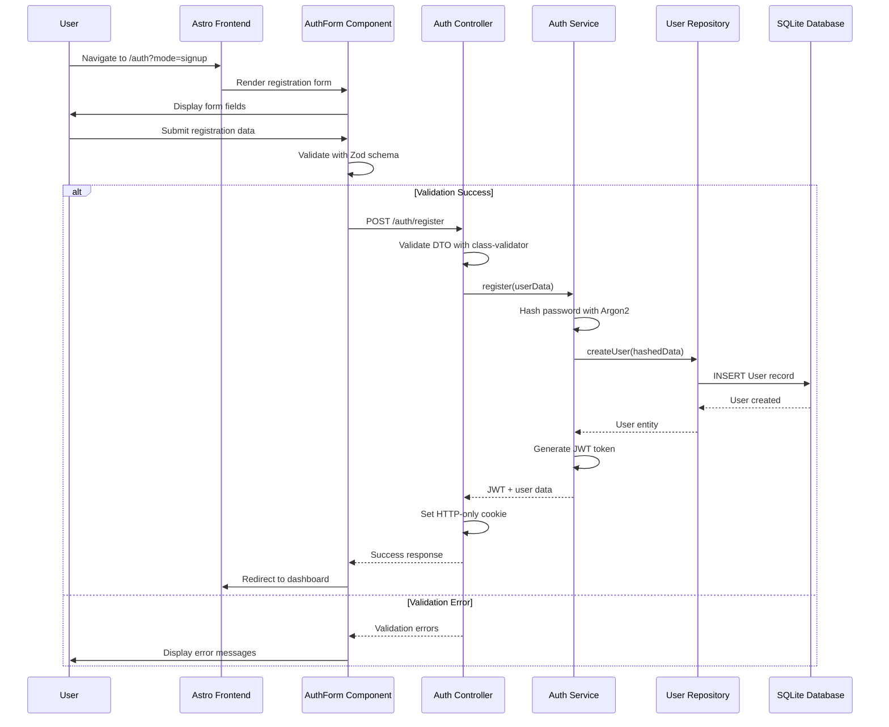
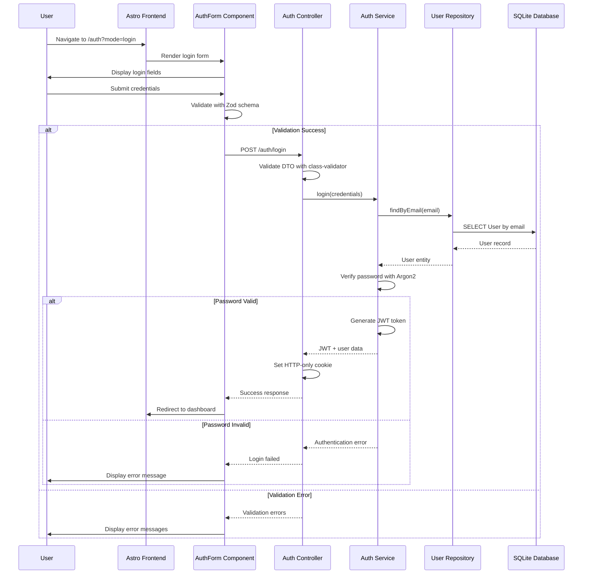
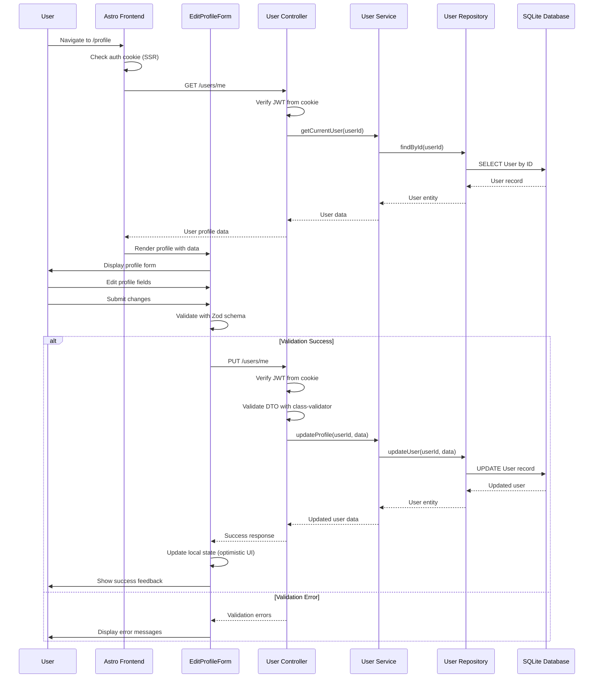

# Core Workflows

## User Registration Workflow

## User Login Workflow

## User Profile Management Workflow

**API Compatibility Guarantee:** All HTTP endpoints remain identical during Epic 2 transformation,
ensuring frontend integration is unaffected by internal Clean Architecture + DDD refactoring.
